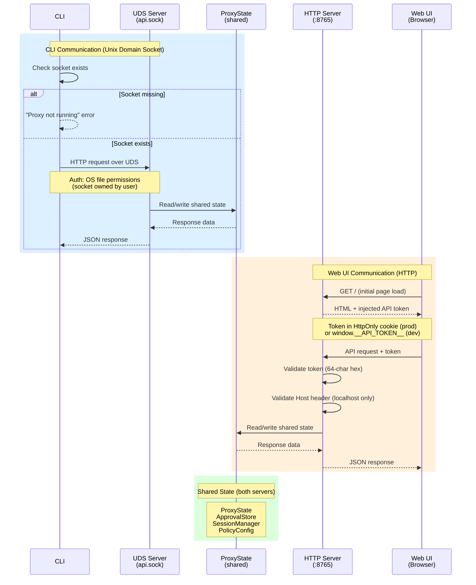

# UI Architecture Diagrams

Diagrams specific to the Web UI, API communication, and frontend state management. For backend/infrastructure diagrams, see [diagrams.md](diagrams.md).

---

## System Architecture

### Current Architecture (UDS + HTTP)

```
┌─────────────────────────────────────────────────────────────────────────────────┐
│                              BACKEND (Python)                                │
│                                                                                 │
│  ┌─────────────────────────────────────────────────────────────────────────┐   │
│  │                         Proxy Manager                                    │   │
│  │  Source of truth for: proxies, pending approvals, cached approvals,     │   │
│  │                       stats, logs, auth state                           │   │
│  └─────────────────────────────────────────────────────────────────────────┘   │
│                                    │                                            │
│          ┌─────────────────────────┼─────────────────────────┐                 │
│          ▼                         ▼                         ▼                 │
│  ┌──────────────────┐     ┌──────────────┐          ┌──────────────┐          │
│  │  UDS Server      │     │  HTTP Server │          │  SSE Stream  │          │
│  │  (CLI only)      │     │  (Browser)   │          │  (real-time) │          │
│  │  api.sock        │     │  :8765       │          │              │          │
│  │  NO TOKEN NEEDED │     │  + Bearer    │          │              │          │
│  └──────────────────┘     └──────────────┘          └──────────────┘          │
│          │                        │                          │                 │
└──────────┼────────────────────────┼──────────────────────────┼─────────────────┘
           │                        │                          │
           ▼                        └────────────┬─────────────┘
    ┌──────────────┐                             │
    │     CLI      │                             ▼
    │              │          ┌──────────────────────────────────────────┐
    │  Connect via │          │              Browser UI                   │
    │  Unix socket │          │                                          │
    │              │          │  ┌────────────────────────────────────┐  │
    │  OS perms =  │          │  │        AppStateContext             │  │
    │  auth        │          │  │  - pending approvals (SSE)         │  │
    │              │          │  │  - stats (SSE)                     │  │
    └──────────────┘          │  │  - connection status               │  │
                              │  │  - approve/deny actions            │  │
                              │  └────────────────────────────────────┘  │
                              │                    │                      │
                              │         (unchanged from current)          │
                              └──────────────────────────────────────────┘
```

### Legacy Architecture (HTTP + Token) - DEPRECATED

```
┌─────────────────────────────────────────────────────────────────────────────────┐
│                              BACKEND (Python)                                │
│                                                                                 │
│  ┌─────────────────────────────────────────────────────────────────────────┐   │
│  │                         Proxy Manager                                    │   │
│  │  Source of truth for: proxies, pending approvals, cached approvals,     │   │
│  │                       stats, logs, auth state                           │   │
│  └─────────────────────────────────────────────────────────────────────────┘   │
│                                    │                                            │
│                    ┌───────────────┴───────────────┐                           │
│                    ▼                               ▼                           │
│           ┌──────────────┐                ┌──────────────┐                     │
│           │  REST API    │                │  SSE Stream  │                     │
│           │  (HTTP)      │                │  (real-time) │                     │
│           └──────────────┘                └──────────────┘                     │
│                    │                               │                           │
└────────────────────┼───────────────────────────────┼───────────────────────────┘
                     │                               │
        ┌────────────┴────────────┐    ┌────────────┴────────────┐
        ▼                         ▼    ▼                         ▼
┌──────────────┐          ┌──────────────────────────────────────────┐
│     CLI      │          │              Browser UI                   │
│              │          │                                          │
│ manager.json │          │  ┌────────────────────────────────────┐  │
│ (read token) │          │  │        AppStateContext             │  │
│              │          │  │  - pending approvals (SSE)         │  │
└──────────────┘          │  │  - stats (SSE)                     │  │
                          │  │  - connection status               │  │
                          │  │  - approve/deny actions            │  │
                          │  └────────────────────────────────────┘  │
                          │                    │                      │
                          │  ┌─────────────────┴─────────────────┐   │
                          │  │         Feature Hooks             │   │
                          │  │                                   │   │
                          │  │  useAuth       useProxies         │   │
                          │  │  useLogs       useDeviceFlow      │   │
                          │  │  useCachedApprovals               │   │
                          │  │  useMultiLogs                     │   │
                          │  └───────────────────────────────────┘   │
                          │                    │                      │
                          │  ┌─────────────────┴─────────────────┐   │
                          │  │           API Layer               │   │
                          │  │  client.ts (retry, error handling)│   │
                          │  └───────────────────────────────────┘   │
                          └──────────────────────────────────────────┘
```

---

## CLI / Web UI / API Communication



---

## SSE Event Flow

```mermaid
sequenceDiagram
    participant UI as Web UI
    participant HTTP as HTTP Server
    participant State as ProxyState
    participant Queue as SSE Queue
    participant Proxy as Proxy Core

    rect rgb(230, 245, 255)
    note over UI,Queue: Client Connection

    UI->>HTTP: GET /api/approvals/pending
    HTTP->>State: subscribe()
    State->>Queue: Create asyncio.Queue (max 100)
    State->>State: Add queue to _sse_subscribers
    HTTP-->>UI: StreamingResponse (text/event-stream)

    HTTP->>UI: event: snapshot<br/>data: {pending_approvals: [...]}
    HTTP->>UI: event: cached_snapshot<br/>data: {cached_approvals: [...]}
    end

    rect rgb(255, 245, 220)
    note over Proxy,UI: Event Broadcasting

    Proxy->>State: broadcast(pending_created, {...})
    State->>Queue: Put event in all subscriber queues
    Queue-->>HTTP: Yield event from queue
    HTTP-->>UI: event: pending_created<br/>data: {...}

    par Keep-alive
        loop Every 30 seconds
            HTTP-->>UI: : keepalive comment
        end
    end
    end

    rect rgb(255, 230, 230)
    note over UI,Queue: Client Disconnect

    UI->>HTTP: Connection closed
    HTTP->>State: unsubscribe(queue)
    State->>State: Remove queue from _sse_subscribers
    State->>Queue: Destroy queue
    end
```



---

## UI State Ownership

### State Distribution

```
┌─────────────────────────────────────────────────────────────────────────────┐
│                              Browser UI (React)                             │
│                                                                             │
│  ┌───────────────────────────────────────────────────────────────────────┐ │
│  │                  AppStateContext (Global Real-time State)             │ │
│  │                                                                       │ │
│  │  State:                          Actions:                             │ │
│  │  ├── pending: PendingApproval[]  ├── approve(id)                     │ │
│  │  ├── stats: ProxyStats           ├── approveOnce(id)                 │ │
│  │  ├── connected: boolean          └── deny(id)                        │ │
│  │  └── connectionStatus                                                 │ │
│  │                                                                       │ │
│  │  Updates via: SSE events (pending_added, pending_resolved, stats)    │ │
│  └───────────────────────────────────────────────────────────────────────┘ │
│                                                                             │
│  ┌───────────────────────────────────────────────────────────────────────┐ │
│  │                    Feature Hooks (Local State per Feature)            │ │
│  │                                                                       │ │
│  │  ┌─────────────────┐  ┌─────────────────┐  ┌─────────────────┐       │ │
│  │  │    useAuth      │  │   useProxies    │  │    useLogs      │       │ │
│  │  │                 │  │                 │  │                 │       │ │
│  │  │ status          │  │ proxies[]       │  │ logs[]          │       │ │
│  │  │ loading         │  │ loading         │  │ loading         │       │ │
│  │  │ loggingOut      │  │ refetch()       │  │ hasMore         │       │ │
│  │  │ logout()        │  │                 │  │ loadMore()      │       │ │
│  │  │ logoutFederated │  │                 │  │ refresh()       │       │ │
│  │  │ refresh()       │  │                 │  │                 │       │ │
│  │  └─────────────────┘  └─────────────────┘  └─────────────────┘       │ │
│  │                                                                       │ │
│  │  ┌─────────────────┐  ┌─────────────────┐  ┌─────────────────┐       │ │
│  │  │ useDeviceFlow   │  │useCachedApproval│  │  useMultiLogs   │       │ │
│  │  │                 │  │                 │  │                 │       │ │
│  │  │ state.userCode  │  │ cached[]        │  │ logs[] (merged) │       │ │
│  │  │ state.polling   │  │ ttlSeconds      │  │ loading         │       │ │
│  │  │ state.error  *  │  │ loading         │  │ hasMore         │       │ │
│  │  │ start()         │  │ clear()         │  │ loadMore()      │       │ │
│  │  │ reset()         │  │ deleteEntry()   │  │ refresh()       │       │ │
│  │  │                 │  │ refresh()       │  │                 │       │ │
│  │  └─────────────────┘  └─────────────────┘  └─────────────────┘       │ │
│  │                                                                       │ │
│  │  ┌─────────────────┐  ┌─────────────────┐  ┌─────────────────┐       │ │
│  │  │   usePolicy     │  │   useConfig     │  │  useIncidents   │       │ │
│  │  │                 │  │                 │  │                 │       │ │
│  │  │ policy          │  │ config          │  │ incidents       │       │ │
│  │  │ loading         │  │ loading         │  │ summary         │       │ │
│  │  │ addRule()       │  │ updateConfig()  │  │ loading         │       │ │
│  │  │ deleteRule()    │  │ refresh()       │  │ refresh()       │       │ │
│  │  │ refresh()       │  │                 │  │                 │       │ │
│  │  └─────────────────┘  └─────────────────┘  └─────────────────┘       │ │
│  │                                                                       │ │
│  │  * = Error state used by UI for conditional rendering                 │ │
│  └───────────────────────────────────────────────────────────────────────┘ │
│                                                                             │
│  ┌───────────────────────────────────────────────────────────────────────┐ │
│  │                         API Layer (client.ts)                         │ │
│  │                                                                       │ │
│  │  ├── fetchWithRetry()  - Exponential backoff (3 retries, 5xx only)   │ │
│  │  ├── apiRequest<T>()   - Generic HTTP handler with error wrapping    │ │
│  │  ├── createSSEConnection() - EventSource wrapper with token          │ │
│  │  └── ApiError          - Custom error class                          │ │
│  └───────────────────────────────────────────────────────────────────────┘ │
└─────────────────────────────────────────────────────────────────────────────┘
```

---

## Error Handling

### Error Patterns by Hook

```
┌────────────────────┬───────────────┬─────────────────┬─────────────────────────┐
│ Hook               │ Error State?  │ Display Method  │ Reasoning               │
├────────────────────┼───────────────┼─────────────────┼─────────────────────────┤
│ AppStateContext    │ NO            │ Toast via SSE   │ Actions silent, SSE     │
│                    │               │                 │ sends pending_not_found │
├────────────────────┼───────────────┼─────────────────┼─────────────────────────┤
│ useAuth            │ NO            │ Toast           │ No UI needs error state │
├────────────────────┼───────────────┼─────────────────┼─────────────────────────┤
│ useDeviceFlow      │ state.error   │ State + Toast   │ LoginDialog renders     │
│                    │               │ + Sound         │ error + "Try Again"     │
├────────────────────┼───────────────┼─────────────────┼─────────────────────────┤
│ useProxies         │ NO            │ Toast (once)    │ List shows empty,       │
│                    │               │                 │ no special error view   │
├────────────────────┼───────────────┼─────────────────┼─────────────────────────┤
│ useLogs            │ NO            │ Toast           │ Context-aware message   │
│                    │               │ (contextual)    │ (404 → "enable DEBUG")  │
├────────────────────┼───────────────┼─────────────────┼─────────────────────────┤
│ useMultiLogs       │ NO            │ Toast           │ Same as useLogs         │
├────────────────────┼───────────────┼─────────────────┼─────────────────────────┤
│ useCachedApprovals │ NO            │ Silent (fetch)  │ Non-critical data       │
│                    │               │ Toast (actions) │ Actions need feedback   │
├────────────────────┼───────────────┼─────────────────┼─────────────────────────┤
│ usePolicy          │ state.error   │ State + Toast   │ PolicyPage needs error  │
│                    │               │ + Sound         │ UI for invalid state    │
├────────────────────┼───────────────┼─────────────────┼─────────────────────────┤
│ useConfig          │ NO            │ Toast + Sound   │ ConfigPage handles      │
│                    │               │                 │ loading state only      │
├────────────────────┼───────────────┼─────────────────┼─────────────────────────┤
│ useIncidents       │ NO            │ Sound only      │ Silent fetch, incidents │
│                    │               │                 │ list shows empty        │
└────────────────────┴───────────────┴─────────────────┴─────────────────────────┘
```

### Error Flow

```
API Call (client.ts)
        │
        ▼
┌───────────────────┐
│ Network Error OR  │──────┐
│ 5xx Response      │      │ Retry with backoff
└───────────────────┘      │ (max 3 attempts)
        │                  │
        │◄─────────────────┘
        ▼
┌───────────────────┐
│ 4xx Response OR   │
│ All Retries Failed│
└───────────────────┘
        │
        ▼
┌───────────────────┐
│ Hook catch block  │
└───────────────────┘
        │
        ├─── useDeviceFlow ───▶ Set state.error + Toast + Sound
        │                       (UI shows error + retry button)
        │
        ├─── useAuth ──────────▶ Toast + Sound
        │                       (user notified)
        │
        ├─── useProxies ───────▶ Toast (once via ref)
        │                       (user notified once)
        │
        ├─── useLogs ──────────▶ Toast (contextual)
        │                       (helpful message for 404)
        │
        ├─── useCachedApprovals ▶ Silent (fetch) / Toast (actions)
        │                         (non-critical vs user action)
        │
        ├─── usePolicy ─────────▶ Set state.error + Toast + Sound
        │                         (UI shows error state)
        │
        ├─── useConfig ─────────▶ Toast + Sound
        │                         (user notified)
        │
        └─── useIncidents ──────▶ Sound only (silent fetch)
                                  (list shows empty)
```

### When to Use Error State vs Toast

```
┌─────────────────────────────────────────────────────────────────────────────┐
│                         Decision Tree                                       │
│                                                                             │
│  Does the UI need to:                                                       │
│  ├── Conditionally render based on error? ──────────▶ Use ERROR STATE      │
│  │   (e.g., show error message + retry button)                             │
│  │                                                                          │
│  ├── Change behavior based on error? ───────────────▶ Use ERROR STATE      │
│  │   (e.g., don't auto-start if previous error)                            │
│  │                                                                          │
│  └── Just notify user something failed? ────────────▶ Use TOAST ONLY       │
│      (e.g., "Failed to load proxies")                                      │
│                                                                             │
│  Currently only useDeviceFlow needs error state:                           │
│  - LoginDialog shows error message                                         │
│  - LoginDialog shows "Try Again" button                                    │
│  - LoginDialog doesn't auto-start if error exists                          │
└─────────────────────────────────────────────────────────────────────────────┘
```

---

## Cross-Component Communication

### Custom Window Events

```
┌───────────────────────────────────────────────────────────────────────────┐
│                                                                           │
│  AppStateContext                                                          │
│       │                                                                   │
│       │  SSE: auth_login, auth_logout, token_refresh_failed              │
│       ▼                                                                   │
│  window.dispatchEvent(new CustomEvent('auth-state-changed'))             │
│       │                                                                   │
│       └──────────────────────────────▶  useAuth                          │
│                                         └── fetchStatus()                │
│                                                                           │
│  AppStateContext                                                          │
│       │                                                                   │
│       │  SSE: new_log_entries                                            │
│       ▼                                                                   │
│  window.dispatchEvent(new CustomEvent('new-log-entries'))                │
│       │                                                                   │
│       └──────────────────────────────▶  useLogs                          │
│                                         └── refresh()                    │
│                                                                           │
└───────────────────────────────────────────────────────────────────────────┘

Events:
├── 'auth-state-changed'  - Triggers auth status refresh
└── 'new-log-entries'     - Triggers log list refresh
```

---

## Authentication Flow

### Browser Authentication (HTTP)

```
┌─────────┐                    ┌──────────────┐                  ┌─────────┐
│ Browser │                    │    Proxy     │                  │   IdP   │
└────┬────┘                    └──────┬───────┘                  └────┬────┘
     │                                │                               │
     │  1. Page load                  │                               │
     │  (token injected in HTML)      │                               │
     │◄───────────────────────────────│                               │
     │                                │                               │
     │  2. GET /api/auth/status       │                               │
     │  Authorization: Bearer <token> │                               │
     │───────────────────────────────▶│                               │
     │                                │                               │
     │  3. {authenticated: false}     │                               │
     │◄───────────────────────────────│                               │
     │                                │                               │
     │  4. POST /api/auth/login       │                               │
     │───────────────────────────────▶│                               │
     │                                │  5. Device flow start         │
     │                                │──────────────────────────────▶│
     │                                │                               │
     │  6. {user_code, verify_uri}    │                               │
     │◄───────────────────────────────│                               │
     │                                │                               │
     │  7. User visits verify_uri     │                               │
     │  and enters user_code          │                               │
     │                                │                               │
     │  8. Poll /api/auth/login/poll  │                               │
     │───────────────────────────────▶│  9. Poll for completion       │
     │                                │──────────────────────────────▶│
     │                                │                               │
     │                                │  10. Tokens                   │
     │                                │◄──────────────────────────────│
     │                                │                               │
     │  11. {status: complete}        │                               │
     │◄───────────────────────────────│                               │
     │                                │                               │
     │  12. SSE: auth_login event     │                               │
     │◄═══════════════════════════════│                               │
     │                                │                               │
     │  13. Refresh auth status       │                               │
     │───────────────────────────────▶│                               │
     │                                │                               │
```

### CLI Authentication (UDS)

```
┌─────────┐                    ┌──────────────┐
│   CLI   │                    │    Proxy     │
└────┬────┘                    └──────┬───────┘
     │                                │
     │  1. Connect to api.sock        │
     │──────────────────────────────▶│
     │                                │
     │  2. GET /api/status            │
     │  (no token - OS perms = auth)  │
     │───────────────────────────────▶│
     │                                │
     │  3. {status: ok}               │
     │◄───────────────────────────────│
     │                                │
```

---

## ProxyState Aggregation

ProxyState is the central hub that aggregates all runtime state for API exposure:

```
┌──────────────────────────────────────────────────────────────────────────┐
│                           ProxyState                                      │
│                    (manager/state.py)                                     │
│                                                                          │
│  ┌────────────────────────────────────────────────────────────────────┐  │
│  │                         Wrapped Stores                              │  │
│  │                                                                     │  │
│  │  ┌─────────────────────┐      ┌─────────────────────┐              │  │
│  │  │   ApprovalStore     │      │   SessionManager    │              │  │
│  │  │   (pep/)            │      │   (pips/auth/)      │              │  │
│  │  │                     │      │                     │              │  │
│  │  │  - cached approvals │      │  - user sessions    │              │  │
│  │  │  - TTL tracking     │      │  - bound IDs        │              │  │
│  │  │  - lookup/insert    │      │  - create/validate  │              │  │
│  │  └─────────────────────┘      └─────────────────────┘              │  │
│  └────────────────────────────────────────────────────────────────────┘  │
│                                                                          │
│  ┌────────────────────────────────────────────────────────────────────┐  │
│  │                      Internal State                                 │  │
│  │                                                                     │  │
│  │  _pending: dict[str, PendingApprovalRequest]   ← HITL requests     │  │
│  │  _sse_subscribers: set[asyncio.Queue]          ← UI connections    │  │
│  │  _requests_total/allowed/denied/hitl: int      ← Stats counters    │  │
│  │  _backend_disconnected: bool                   ← Connection state  │  │
│  │  _client_id: str                               ← MCP client name   │  │
│  └────────────────────────────────────────────────────────────────────┘  │
│                                                                          │
│  ┌────────────────────────────────────────────────────────────────────┐  │
│  │                      Exposed via API                                │  │
│  │                                                                     │  │
│  │  get_proxy_info() → ProxyInfo     GET /api/proxies                 │  │
│  │  get_stats() → ProxyStats         GET /api/proxies (stats field)   │  │
│  │  get_pending_approvals()          GET /api/approvals/pending/list  │  │
│  │  get_cached_approvals()           GET /api/approvals/cached        │  │
│  │  get_sessions()                   GET /api/auth-sessions           │  │
│  └────────────────────────────────────────────────────────────────────┘  │
│                                                                          │
│  ┌────────────────────────────────────────────────────────────────────┐  │
│  │                      SSE Broadcasting                               │  │
│  │                                                                     │  │
│  │  emit_event(type, data)           → All subscribers                │  │
│  │  emit_system_event(type, **kw)    → With severity/toast styling    │  │
│  │  is_ui_connected                  → Check if any subscribers       │  │
│  └────────────────────────────────────────────────────────────────────┘  │
└──────────────────────────────────────────────────────────────────────────┘
                                    │
              ┌─────────────────────┼─────────────────────┐
              ▼                     ▼                     ▼
      ┌──────────────┐      ┌──────────────┐      ┌──────────────┐
      │  REST API    │      │  SSE Stream  │      │ HITL Handler │
      │  (routes/)   │      │  /api/...    │      │  (pep/)      │
      │              │      │  /pending    │      │              │
      │  Read state  │      │  Push events │      │  Check       │
      │  via getters │      │  to browsers │      │  is_ui_      │
      │              │      │              │      │  connected   │
      └──────────────┘      └──────────────┘      └──────────────┘
```
